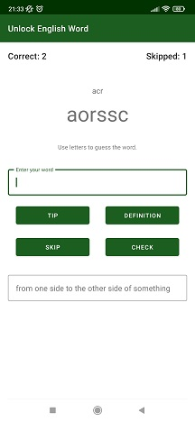
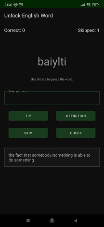

# Unlock English Word

### Goal
This is an application to learn english words and their meanings.

The main goals of crating this app are two:
1. Deliver tool to help people to learn or to polish their English skills.
2. Practice among others: Fragments, ViewModel as Architectural Jetpack Components.

### Screenshots

### Overview

There are many way of learning something new or polish something that we already known.
In the Unlock English Word application you need to look at the shuffled letters word and try to guess what word is this?

If the word is to difficult for you, you are able to add one letter or display a definition of the word (as hints).

After this practice you'll be able not only to know a word but also it's definition.
Ready for it?

So, let's go!
Install.
Learn.
Improve.
Play.
Enjoy!

### Dear Visitor

If you see an opportunity to improve my code do not hesitate to contact me:
maciej.k.glownia@gmail.com. If you want to copy it and develop with your own idea, take it and enjoy
learning path.